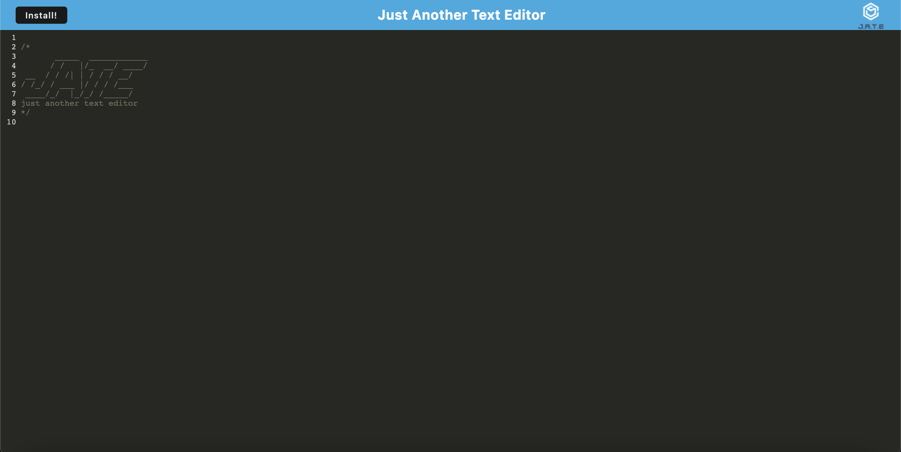

# Text-Editor

## Table of Contents
* [Description](#desc)  
* [Installation](#install)  
* [Usage](#usage)  
* [Credits](#credits)  
* [License](#license)  
* [Github](#github)  

## Description

The purpose of this project was to build a text editor that runs in the browser. The app is a single-page application that meets the PWA criteria. Additionally, it features a number of data persistence techniques that serve as redundancy in case one of the options is not supported by the browser. The application also uses an IndexedDB database to get and store data. Users can input text and it is saved in the IndexedDB database when editor loses focus. The data persists when the page is loaded and re-populates the text editor so you can pick up where you left off!

## Installation

Follow the link below in the GitHub section to the deployed application on Heroku!

## Usage
The following image shows the application's appearance and functionality.

The application should appear as follows when visiting the deployed link on heroku:

 
## Credits
Uoft SCS Coding Bootcamp Gitlab

 
## License
Copyright [2022] [Sevag Gaprielian]

Licensed under the Apache License, Version 2.0 (the "License"); you may not use this file except in compliance with the License.
You may obtain a copy of the License at http://www.apache.org/licenses/LICENSE-2.0.

Unless required by applicable law or agreed to in writing, software
distributed under the License is distributed on an "AS IS" BASIS,
WITHOUT WARRANTIES OR CONDITIONS OF ANY KIND, either express or implied.
See the License for the specific language governing permissions and
limitations under the License.

 
## GitHub
Github: sevaggap  
Deployed Application on Heroku: https://damp-castle-76507.herokuapp.com/